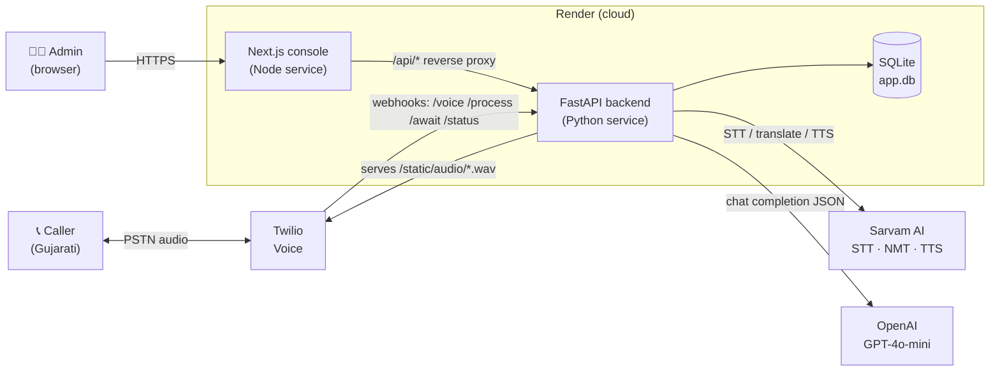
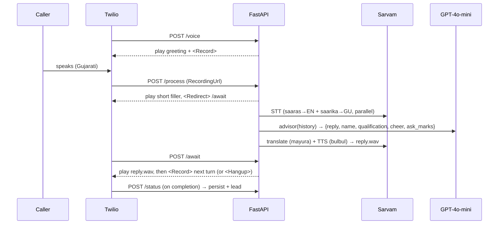
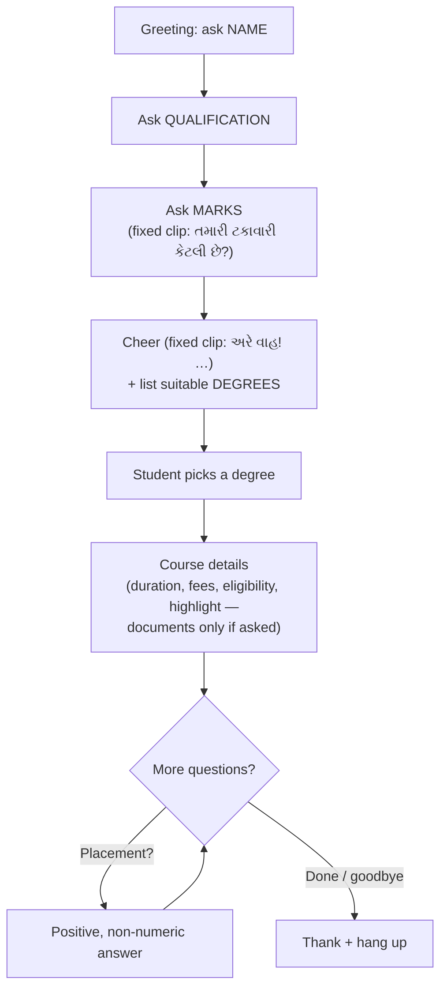
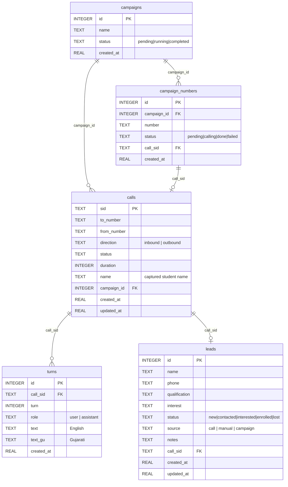

# Marwadi University – Admission Voice Agent

A Gujarati **voice agent** that answers/places phone calls and runs a guided
admission conversation: it asks the student's **name**, **latest qualification**
and **marks**, cheers the marks, lists the **degrees they can pursue**, and gives
**course details** for whichever degree they pick (fees, duration, eligibility;
placement questions handled too). A **Next.js admin console** provides a dialer,
leads CRM, campaigns, analytics and call logs with the full Gujarati transcript.

---

## 1. Technology stack used

| Layer | Technology | Purpose |
|---|---|---|
| **Telephony** | **Twilio** Programmable Voice | Places/answers calls; turn-based `<Record>` + `<Play>` webhooks |
| **Speech (STT)** | **Sarvam AI** – Saaras (`speech-to-text-translate`) + Saarika (`speech-to-text`) | Gujarati audio → English (for the LLM) **and** Gujarati transcript (for display), run in parallel |
| **Translation** | **Sarvam AI** – Mayura (`translate`) | English → Gujarati before speech synthesis |
| **Speech (TTS)** | **Sarvam AI** – Bulbul v2 (speaker *anushka*, 8 kHz) | English/Gujarati reply → Gujarati audio |
| **LLM / brain** | **OpenAI GPT-4o-mini** | The admission advisor; reasons in English, returns JSON |
| **Backend** | **Python 3 · FastAPI · Uvicorn** | Twilio webhooks + JSON REST API |
| **Database** | **SQLite** (stdlib `sqlite3`, WAL mode) | Calls, transcripts, campaigns, leads |
| **Frontend** | **Next.js 14 (App Router) · React 18 · TypeScript** | Admin console (dependency-free CSS/SVG charts) |
| **HTTP client** | **httpx** (HTTP/2, keep-alive) | Low-latency calls to Sarvam / Twilio |
| **Tunnel (local)** | **ngrok** | Exposes the local backend to Twilio during development |
| **Hosting** | **Render** (backend = Python web service, frontend = Node web service) | Cloud deployment |

> **Fallback:** if `SARVAM_API_KEY` is not set, the app falls back to **Bhashini**
> (ULCA / Dhruva) for STT/translate/TTS via `app/bhashini.py`.

---

## 2. System architecture



**Key points**
- The **browser only talks to the frontend**; `next.config.js` rewrites `/api/*`
  to the backend, so the session cookie works with **no CORS setup**.
- **Twilio talks to the backend directly** (voice webhooks). Generated TTS `.wav`
  files are served by the backend from `/static/audio/` (URL = `PUBLIC_BASE_URL`).
- The backend is **API-only**: its root `/` 307-redirects to `FRONTEND_URL`.
- **Auth:** cookie session; `/api/*` requires login, Twilio webhooks stay public.

---

## 3. Application flow diagram

### 3a. Per-turn voice pipeline (low latency)



### 3b. Conversation script (what the agent asks)



---

## 4. ER diagram



> SQLite store at `data/app.db` (auto-created, WAL mode, git-ignored). Tables are
> defined in [`app/db.py`](app/db.py); light migrations run on startup.

---

## 5. Paid services and cost details

All are **usage-based**. Figures below are **approximate for a short demo call**
and **must be verified** against each provider's current pricing page — rates
change and vary by region/plan.

| Service | Billed for | Pricing model | Rough demo cost | Notes |
|---|---|---|---|---|
| **Twilio Voice** | call minutes + phone number | per-minute + monthly number rental | number ≈ **$1–2/mo**; voice ≈ **$0.007–0.015/min** | Free **trial credit** (~$15); trial can only call **verified** numbers |
| **Sarvam AI** | STT + translate + TTS calls | per request / per audio-sec / per char | a **few ₹ per call** (usage-based) | Verify at dashboard.sarvam.ai; free trial credits on signup |
| **OpenAI GPT-4o-mini** | LLM tokens | per-token (in/out) | **< $0.01 per call** (mini is very cheap; short prompts) | ~$0.15 / 1M input, ~$0.60 / 1M output tokens *(approx — verify)* |
| **Render** | hosting | free tier or paid instances | **$0** (free) or **~$7/mo per service** paid | Free tier **sleeps after ~15 min** idle (≈50 s cold start) & has **ephemeral disk** |
| **ngrok** | local tunnel | free tier sufficient for dev | **$0** | Only used in local development, not in production |

**Per-call estimate (demo, ~1–2 min):** roughly **a few ₹ / a few US-cents** total
(Twilio minutes + Sarvam STT/TTS + a fraction of a cent of GPT-4o-mini). Hosting is
the main fixed cost if you leave paid instances running.

> ⚠️ These fees/estimates are **representative** for a demo. Confirm live pricing
> before relying on them.

---

## 6. Other relevant technical information

### 6a. Setup (local)

```powershell
# from the project root
copy .env.example .env      # then fill in the keys below
.\run.ps1                   # creates venv, installs deps, starts uvicorn on :8000
ngrok http 8000             # second terminal -> copy the https URL into PUBLIC_BASE_URL
```
Frontend (second app):
```powershell
cd frontend
npm install
npm run dev                 # http://localhost:3000  (sign in: admin / marwadi123)
```

**`.env` keys**
- `OPENAI_API_KEY`
- `SARVAM_API_KEY` (+ optional `SARVAM_STT_MODEL`, `SARVAM_TRANSCRIBE_MODEL`,
  `SARVAM_TTS_MODEL`, `SARVAM_TTS_SPEAKER`) — *or* Bhashini keys as fallback
- `TWILIO_ACCOUNT_SID`, `TWILIO_AUTH_TOKEN`, `TWILIO_FROM_NUMBER`
- `PUBLIC_BASE_URL` (backend's public URL — ngrok locally, Render URL in prod)
- `FRONTEND_URL`, `ADMIN_USERNAME`, `ADMIN_PASSWORD`

Point your Twilio number's **"A call comes in"** webhook at
`https://<public-base-url>/voice` (HTTP **POST**).

### 6b. Deployment (Render)

| Service | Root dir | Build | Start |
|---|---|---|---|
| Backend (Python) | *(repo root)* | `pip install -r requirements.txt` | `uvicorn app.main:app --host 0.0.0.0 --port $PORT` |
| Frontend (Node) | `frontend` | `npm install && npm run build` | `npx next start -p $PORT` |

Set backend `PUBLIC_BASE_URL` = its own Render URL, `FRONTEND_URL` = the console
URL; set frontend `BACKEND_URL` = the backend Render URL.

### 6c. REST API

```
POST /api/login | POST /api/logout                        session auth
POST /api/call                {number}                    place an outbound call
GET  /api/calls | GET /api/calls/{sid}                     call logs + transcript
POST /api/campaigns {name,numbers[]} | GET /api/campaigns  campaigns
POST /api/campaigns/{id}/start                             start dialing
GET/POST /api/leads | PATCH/DELETE /api/leads/{id}         leads CRUD
GET  /api/overview | GET /api/analytics | GET /api/stats   dashboard data
```
Public Twilio webhooks: `/voice`, `/process`, `/await`, `/status`.

### 6d. Admin console (Next.js)

Sign in `admin` / `marwadi123`. Sections: **Dashboard** (metrics + charts),
**Dialer** (keypad + **live Gujarati chat** during the call), **Leads**
(auto-captured name + qualification, manual CRUD), **Campaigns** (CSV upload +
sequential dialing), **Analytics**, **Call Logs** (status, duration, name, full
**Gujarati** transcript with English underneath).

### 6e. Project layout

```
app/
  main.py          FastAPI + Twilio webhooks (/voice, /process, /await, /status)
  api.py           JSON REST API (dialer, campaigns, leads, analytics)
  auth.py          cookie-session auth
  dialer.py        outbound call placement + campaign runner
  db.py            SQLite persistence + migrations
  voice.py         provider selector -> Sarvam (default) or Bhashini
  sarvam.py        Sarvam STT / translate / TTS client
  bhashini.py      Bhashini fallback client (+ float->PCM16 for Twilio)
  openai_agent.py  GPT-4o-mini advisor (JSON: reply, end, name, qualification, cheer, ask_marks)
  degrees.py       loads dataset + builds the LLM catalog
  config.py        env config + assert_ready() + use_sarvam()
frontend/          Next.js admin console
data/degrees.json  10 degrees (en + gu)
data/app.db        SQLite store (auto-created; git-ignored)
scripts/           smoke_test, test_webhooks, scrape/translate, place_call
static/audio/      generated TTS wav files (served to Twilio)
```

### 6f. Latency & reliability notes
- Inbound STT runs the two Sarvam calls **in parallel**; replies are kept short
  (degree names spoken in full so TTS pronounces them cleanly).
- Fixed phrases (greeting, rotating fillers, **marks question**, **marks cheer**,
  closing) are **pre-synthesized and cached**; the marks turns skip live TTS.
- `/process` acknowledges instantly with a short filler, then `/await` plays the
  reply the moment it's ready (no dead air). `<Record timeout=3>` avoids cutting
  the caller off mid-sentence.
- Proper-noun fixups (e.g. **મરવાડી → મારવાડી**) and punctuation softening
  (`!` mis-read as "factorial") are applied before speech.

### 6g. Tests
```powershell
python -m scripts.smoke_test     # config + data + advisor + Sarvam voice (real APIs)
python -m scripts.test_webhooks  # Twilio webhook flow, fully mocked (no network)
```

### 6h. Data
`data/degrees.json` holds **10 degrees** (English + Gujarati `*_gu` fields:
`degree_name, fees, eligibility, required_documents, duration, suitable_for,
highlights`). Fees/eligibility are **representative demo figures** — verify on the
official site before quoting to real applicants.
